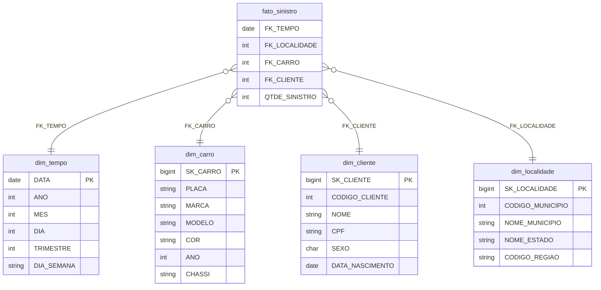

# Modelo Dimensional — Camada Gold

## Star Schema



## Descrição das Tabelas

### `dim_carro`
Dimensão de veículos, desnormalizada com marca e modelo via JOIN da Silver.

- Chave de negócio: `PLACA`
- Surrogate key: `SK_CARRO` (identity bigint)

### `dim_cliente`
Dados cadastrais do segurado.

- Chave de negócio: `CODIGO_CLIENTE`
- Surrogate key: `SK_CLIENTE` (identity bigint)

### `dim_localidade`
Localidade desnormalizada: município + estado + código de região.

- Chave de negócio: `CODIGO_MUNICIPIO`
- Surrogate key: `SK_LOCALIDADE` (identity bigint)

!!! info "Observação sobre Região"
    A tabela `regiao` no banco de origem contém dados de município. O `CODIGO_REGIAO` é extraído diretamente da tabela `estado` (coluna `cd_regiao`). Não existe `NOME_REGIAO` na fonte — apenas o código numérico.

### `dim_tempo`
Calendário gerado via PySpark cobrindo 2023–2026.

### `fato_sinistro`
Fato agregado com contagem de sinistros por data, localidade, veículo e cliente.

## Estratégia SCD

Todas as dimensões usam **SCD Tipo 1** (sobrescrita) implementada via `MERGE INTO`:

```sql
MERGE INTO gold.dim_xxx AS d
USING origem AS r
ON r.chave_negocio = d.chave_negocio
WHEN MATCHED AND (...campos mudaram...) THEN UPDATE SET ...
WHEN NOT MATCHED THEN INSERT ...
```
