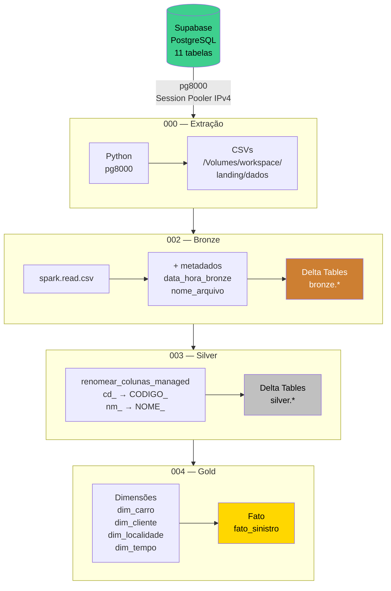

# Visão Geral da Arquitetura

## Arquitetura Medalhão

A Arquitetura Medalhão organiza os dados em camadas progressivas de qualidade, cada uma com responsabilidade bem definida.

## Princípios Adotados

- **Managed Tables** — todas as tabelas Delta são gerenciadas pelo Unity Catalog
- **Overwrite + Schema Evolution** — reprocessamento seguro com `overwriteSchema: true`
- **SCD Tipo 1** — dimensões atualizadas via MERGE (sem histórico)
- **Rastreabilidade** — cada registro carrega metadados de origem e timestamp de processamento
