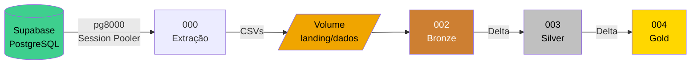

# 🏛️ Lakehouse Arquitetura Medalhão

Pipeline de dados completo implementando a **Arquitetura Medalhão** no Databricks Serverless, com ingestão a partir do Supabase (PostgreSQL).

## Fluxo Geral

## Camadas

| Camada | Schema | Formato | Descrição |
|---|---|---|---|
| Landing | `landing` | CSV | Dados brutos extraídos do Supabase |
| Bronze | `bronze` | Delta | Ingestão raw com metadados |
| Silver | `silver` | Delta | Dados padronizados e com Data Quality |
| Gold | `gold` | Delta | Modelo dimensional para análise |

## Início Rápido

1. Execute o notebook **001** para criar a infraestrutura
2. Configure a dependência `pg8000` no ambiente do Job
3. Execute o notebook **Extract_notebook** para extrair os dados do Supabase
4. Execute **002 → 003 → 004** em sequência
5. Depois execute o **005** para apagar todos os dados e começar do zero
