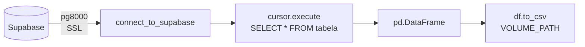

# 000 — Extração (Supabase)

Notebook responsável por conectar ao banco PostgreSQL no Supabase e extrair todas as tabelas para o Volume do Databricks como arquivos CSV.

## Fluxo



## Configuração

```python
DB_HOST     = "aws-1-us-west-1.pooler.supabase.com"
DB_PORT     = 5432
DB_NAME     = "postgres"
DB_USER     = "postgres.<project-ref>"
DB_PASSWORD = "<senha>"
VOLUME_PATH = "/Volumes/workspace/landing/dados"

TABLES_TO_EXTRACT = [
    "apolice", "carro", "cliente", "endereco", "estado",
    "marca", "modelo", "municipio", "regiao", "sinistro", "telefone"
]
```

## Função de Conexão

```python
import pg8000

def connect_to_supabase():
    conn = pg8000.connect(
        host=DB_HOST,
        port=DB_PORT,
        database=DB_NAME,
        user=DB_USER,
        password=DB_PASSWORD,
        ssl_context=True
    )
    return conn
```

## Loop de Extração

```python
dbutils.fs.mkdirs(VOLUME_PATH)  # garante que o diretório existe

for table_name in TABLES_TO_EXTRACT:
    cursor = conn.cursor()
    cursor.execute(f"SELECT * FROM {table_name}")
    columns = [desc[0] for desc in cursor.description]
    df = pd.DataFrame(cursor.fetchall(), columns=columns)
    cursor.close()
    df.to_csv(f"{VOLUME_PATH}/{table_name}.csv", index=False, encoding='utf-8')
```

## Dependência de Ambiente

Configurar no **Configure Environment** do Job:

```
pg8000
```

!!! danger "Não usar psycopg2"
    O `psycopg2` e `psycopg2-binary` causam SIGABRT (exit code 134) no Databricks Serverless por conflito de bibliotecas C com a JVM do Spark. Use exclusivamente `pg8000`.

!!! warning "Session Pooler obrigatório"
    O Databricks Serverless só suporta IPv4. A conexão direta do Supabase usa IPv6 por padrão e causa timeout. Configure o **Session Pooler** no painel do Supabase (porta 5432, user no formato `postgres.<project-ref>`).
